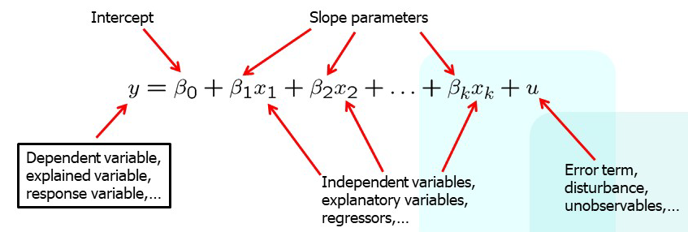

# OLS Regression

- 2023-10-06 10:10-12:10
- Instructor: Christy Pu
- Course: Applied Econometrics for Health Policy

<!-- [toc] -->

---

## 快速回顧：關於研究的常見問題解答

1. 基於理論陳述感興趣的**因果關係** (State the **causal relationship** of interest, based on theory)
   - 一個實證研究最容易被人詬病的部分。這是這堂課的重點，不只是要說明有關連性，而是要證明是否有因果關係。
2. 設計假設性的**理想實驗**來驗證研究假設 (Design the hypothetical **ideal experiment** to test the hypothesis)
   - 必須要先幻想一個理想的實驗，雖然無法達成，但是透過這種想像，才能體會或理解到真實的實驗會具有哪些 bias 或限制。
3. 具體說明你的**識別策略**，例如：自然實驗 (Specify on your **identification strategy**, e.g. natural experiment)
   - 自然實驗：透過一個自然的事件，偶然造成的幾近隨機分派的事件。畢竟有很多研究難以通過 IRB。
4. 檢查你的**統計推論模型** (Check on your **mode of statistical inference**)

## Multiple Regression

- 即「透過多個變數如 $x_1, x_2, \dots, x_k$ 來解釋變數 $y$」。
- Multiple Linear Regression 的定義：
    $$y = \beta_0 + \beta_1 x_1 + \beta_2 x_2 + \dots + \beta_k x_k + u$$
    其中：
    - $x_i$ 為**獨立**變數 (**independent** variable)，這點非常重要。有時又被稱為解釋變數 (explanatory variable)。
    - $\beta_0$ 為截距，說明當所有 $x_i = 0$ 時 $\hat{y}$ 的值。
    - $\beta_i$ 為參數 (parameter)，是迴歸方程對 $x_i$ 的斜率 (slope)，直觀上的表示 $x_i$ 對 $y$ 的影響程度。
    - 最後的 $u$ 是 **Error Term**。所有模型所無法解釋的因子、誤差，都會被歸於此項之中。如何降低 $u$ 或是修正 $u$ 所帶來的影響，是一大重點。
  

- 兩種 regression 的比較：    
    |  | Multivariable Regression (Multiple Regression) | Multivariate Regression |
    | --- | --- | --- |
    | **基本差異** | 存在多個自變數或解釋變數 ($x$) | 存在多個依變數或反應變數 ($y$) |
    | **範例** (以線性迴歸為例) | $y = \alpha + x_1 \beta_1 + x_2 \beta_2 + \dots + x_k \beta_k + \varepsilon$ | $Y_{n \times p} = X_{n \times (k + 1)}\cdot\beta_{(k + 1) \times p} +\varepsilon$ |

    - 關於 Multivariable 與 Multivariate 參見：
      Hidalgo, B., & Goodman, M. (2013). **Multivariate or multivariable regression?.** *American journal of public health*, *103*(1), 39–40. https://doi.org/10.2105/AJPH.2012.300897
